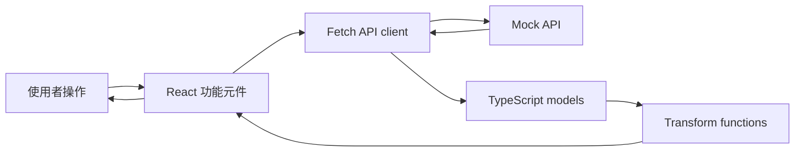

# 前端技術與 UI 規格書

## 1. 文件目的

本文件定義「文件上傳、解析、欄位審核」前端第一版的技術選擇與 UI 元件使用方式，作為後續建立前端專案與實作的共同依據。

本文件不修改後端服務，也不重新定義後端 API。後端契約以根目錄 `README.md` 為準。

## 2. 技術選擇

### 2.1 核心技術

| 類別 | 選擇 | 使用目的 |
|---|---|---|
| UI framework | React | 建立頁面、元件與流程狀態 |
| 語言 | TypeScript | 定義 API 資料與前端狀態，降低欄位處理錯誤 |
| 建置工具 | Vite | 提供開發伺服器與 production build |
| CSS | Tailwind CSS | 建立版面、色彩、間距與 responsive 樣式 |
| UI 元件 | shadcn/ui | 提供可直接修改的 UI 元件實作 |
| 互動原語 | Radix UI | 支援 Dialog、Select、Accordion 等元件的互動與無障礙基礎 |
| 圖示 | lucide-react | 提供一致的操作與狀態圖示 |
| 測試 | Vitest + Testing Library | 測試資料整理、必填驗證與主要使用者行為 |

### 2.2 選型原則

- shadcn/ui 是專案使用的 UI 元件層，不把 Radix UI 直接當成另一套視覺元件庫。
- Radix UI 是 shadcn/ui 使用的底層互動原語；需要客製互動時才直接使用 Radix primitive。
- Tailwind 負責專案的視覺樣式與版面，不額外引入 Material UI、Ant Design 等視覺系統。
- lucide-react 只用於操作與狀態提示，不以圖示取代必要文字。
- 優先使用瀏覽器原生 `fetch` 與 `AbortController`，不額外引入 Axios 或全域狀態管理套件。

## 3. 套件範圍

### 3.1 第一版必要套件

Runtime dependencies：

- `react`
- `react-dom`
- `lucide-react`
- `eventsource-parser`

Development dependencies：

- `typescript`
- `vite`
- `@vitejs/plugin-react`
- `tailwindcss`
- `@tailwindcss/vite`
- `vitest`
- `jsdom`
- `@testing-library/react`
- `@testing-library/jest-dom`
- `@testing-library/user-event`

shadcn/ui 所需的 Radix 套件由加入元件時依實際使用情況產生，不預先安裝整套 Radix 元件。

### 3.2 不列入第一版

- `axios`：原生 `fetch` 已足夠，且可以直接配合 `AbortController` 中止解析等待。
- `react-router-dom`：目前只有單一工作流程，以流程狀態切換即可。
- Redux、Zustand：狀態範圍限制在單一解析任務，不需要全域 store。
- React Query：此流程是上傳加 SSE 串流，不是一般 CRUD 查詢。
- Material UI、Ant Design：避免引入第二套視覺系統，保留 Tailwind 與 shadcn/ui 的一致性。
- `react-hook-form`、`zod`：第一版只有三個必填欄位的非空驗證，尚不需要複雜表單抽象。

## 4. UI 元件對應

| 使用情境 | 元件 | 使用規則 |
|---|---|---|
| 選擇或重新選擇文件 | Button、Input type=file | 顯示檔名、檔案大小與目前狀態 |
| 上傳、取消、重試、完成 | Button | 主要動作同一時間只保留一個視覺主按鈕 |
| 解析階段 | Progress、Badge | 同時顯示階段文字與進度，不只顯示 spinner |
| 群組欄位 | Accordion 或群組區塊 | 依四個群組呈現，群組內保留後端回傳順序 |
| 欄位值編輯 | Input、Textarea | 短值使用 Input，較長內容使用 Textarea |
| 多候選值 | Select 或 RadioGroup | 顯示候選值，保留自行輸入的路徑 |
| 必填欄位 | Badge、Input error state | 必填缺漏需同時在欄位與摘要區可辨識 |
| 低信心欄位 | Badge、Alert | 顯示「建議檢查」，不要只依賴顏色區分 |
| 解析錯誤 | Alert | 顯示使用者可理解的訊息與重試操作 |
| 取消確認 | Dialog | 只有取消可能造成資料或進度遺失時才使用 |
| 頁碼與次要資訊 | Text、Tooltip | 降低視覺權重，不和欄位值競爭注意力 |
| 操作圖示 | lucide-react | 圖示按鈕需提供 aria-label 或 tooltip |

## 5. 介面資訊層級

### 5.1 使用者第一眼應看到

審核頁面優先顯示：

1. 目前文件名稱與整體狀態。
2. 尚待處理的必填缺漏數量。
3. 需要人工檢查的低信心欄位數量。
4. 主要操作，例如「完成審核」或「返回解析」。

### 5.2 降級顯示的資訊

- 精確信心度數值可放在次要文字或 tooltip；主畫面優先顯示「建議檢查」。
- 頁碼保留，但使用低視覺權重顯示，避免搶走欄位值的注意力。
- 候選答案平時收在欄位控制項內，只有存在多候選值時才顯示。
- 原始值與編輯後值不同時放在主欄位中，避免使用者不知道哪個會被送出；如需追溯，放在輔助資訊中。

## 6. UI 元件架構圖

### 6.1 各層責任

#### App Shell

負責頁面容器、整體寬度、主要區域與共用版面，不處理 API 細節，也不直接修改欄位資料。

#### 功能元件層

- `UploadPanel`：處理文件選擇、檔案資訊與上傳操作。
- `ExtractionProgress`：顯示後端回傳的解析階段、進度與已取得欄位數。
- `ReviewWorkspace`：組合審核畫面，提供摘要、群組與主要操作區。
- `ReviewSummary`：集中顯示必填缺漏、低信心欄位與待處理數量。
- `ReviewGroup`：依 `group` 顯示欄位，保留每個群組收到的原始順序。
- `ReviewField`：負責單一欄位的值、候選答案、頁碼、信心度與編輯操作。

功能元件只描述畫面與使用者操作，不直接處理 SSE chunk 的切割或欄位分組演算法。

#### UI 元件層

- shadcn/ui 提供專案實際使用的 Button、Input、Alert、Progress、Select 等元件。
- Radix UI 提供 Select、Dialog、Accordion 等互動元件的鍵盤操作、focus 與開關行為。
- Tailwind CSS 負責元件外觀、版面、間距、色彩與 responsive 規則。
- lucide-react 提供上傳、警告、錯誤、完成、取消與展開等圖示。

這一層不應放入 API 呼叫或業務驗證。UI 元件只接收 props 與 callback，保持可重用與可測試。

#### 資料與 API 層

- `Client` 使用原生 `fetch` 呼叫上傳 API，使用 `AbortController` 管理 SSE 請求的中止。
- `Model` 定義後端回傳的文件、欄位與 SSE event TypeScript 型別。
- `Transform` 將後端欄位依群組整理、維持原始順序，並提供必填欄位驗證。
- UI 只使用整理後的資料，不在元件內重複實作分組與驗證邏輯。

### 6.2 資料流方向



資料流採單向傳遞：API 回應先經過型別與資料整理，再傳入 UI 元件；UI 元件透過 callback 回報編輯結果，不直接改寫 API 原始回應。這樣可以把串流解析、資料轉換與畫面呈現分開，降低元件之間的耦合。

### 6.3 建議的目錄結構

```text
src/
	api/
		documents.ts
		extractStream.ts
	components/
		UploadPanel.tsx
		ExtractionProgress.tsx
		ReviewWorkspace.tsx
		ReviewSummary.tsx
		ReviewGroup.tsx
		ReviewField.tsx
		ui/
			button.tsx
			input.tsx
			alert.tsx
			progress.tsx
			select.tsx
	models/
		extraction.ts
	utils/
		groupFields.ts
		validateRequiredFields.ts
	App.tsx
	main.tsx
```

### 6.4 架構限制

- 元件不可直接依賴後端 JSON 的未整理格式。
- `ReviewField` 不負責決定欄位分組或全域完成條件。
- `ReviewGroup` 不重新排序欄位，只依整理層提供的順序呈現。
- shadcn/ui 元件可以客製樣式，但不應在各頁面複製相同的互動邏輯。
- API 層不依賴 React，讓資料整理與測試可以在沒有瀏覽器 DOM 的環境執行。
